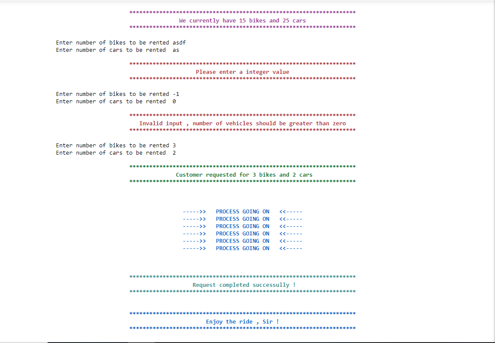
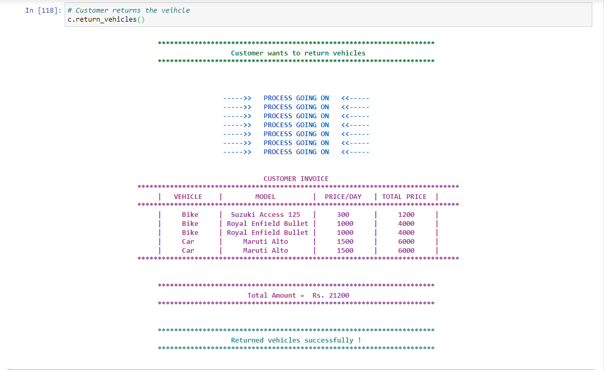
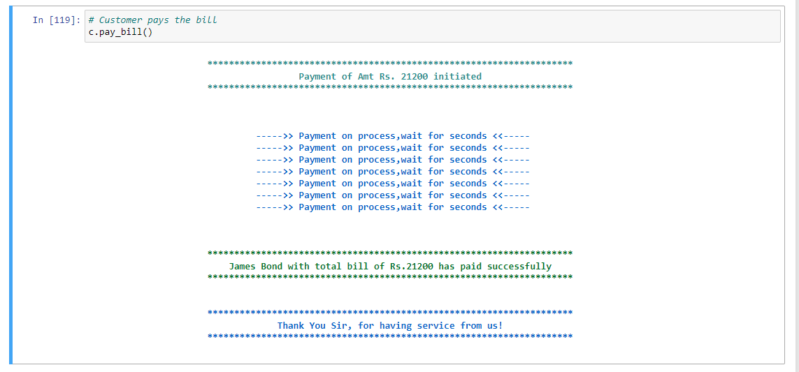

# Vehicle-Rental-System-Oops-Project-2
Using concept of OOPs programming in Python

### GOAL OF THE PROJECT
This project has biased approach towards concepts of OOPs like abstraction , polymorphism , inheritence

 <b>Note:</b>
This project can be implemented with different appoaches and with more efficiency but we have focused mainly on OOPs part
<b>Hints :</b>
   like connecting with database or excel file keeping track of vehicles and customers and can easily manipulate them using OS module in python 

#### Inventory :-
* Inventory have bikes and cars enlisted with different models and rent_price/day
* Vehicle can be added and removed from stocks and rented as well
* Generates and display bill of customer

#### Customer
* Customer are validated with identiy proof
* A customer can rent vehicles and return the vehicles as well
* They can pay the bill

#### Porject Preview

  

